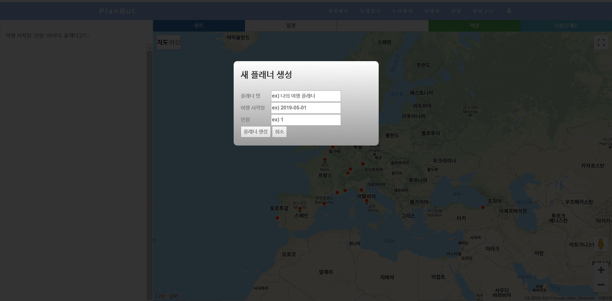

# planBut (플랜벗)
프로젝트 플랜벗 (2019.4 ~ 2019.5) - 여행 플래너

여행 계획에 필요한 동선 짜기 및 동행 찾기, 플래너 관리를 할 수 있는 사이트
  

  

● 개발 스택
--
| 구분 | 내용 |
| :-----------: | :------------ |
| **Develop** | Java, Spring Framework, MyBatis, JSP, HTML/CSS, Javascript, Ajax |
| **DB** | MariaDB (MySQL) |
| **Library** | jQuery, Bootstrap, FullCalendar, Moment.js |
| **OpenAPI** | Google Maps API |
| **Version Control** | Git *(Feature Branch Workflow)* |
| **Tools** | Eclipse/STS, VSCode, DBeaver, SourceTree |

 

● 주요 기능
--
  지도(Google Maps), 캘린더(FullCalendar), 채팅
  

● 메뉴 소개
--

+ 계획짜기
  * 1단계-도시계획
  * 2단계-세부계획
  * 일정(캘린더)

+ 동행찾기
  * 동행 추천
  * 동행 게시판

+ 투어예약
  * 투어목록
  * 투어 정보
  * 투어 예약

+ 여행지

+ 광장
  * 자유게시판

+ 마이페이지
  * 내 플래너
    - 캘린더/사진/일정/일일경로
  * 내 동행
  * 내 투어예약
  * 문의 내역
  * 내 정보 수정

+ 기타
  * 회원가입
  * 로그인/로그아웃
  * 장바구니

  

● 미리보기
--

1. 계획짜기

 

2. 동행찾기
 *추후 추가*

3. 투어예약
 *추후 추가*

 

4. 플래너 (마이페이지)

